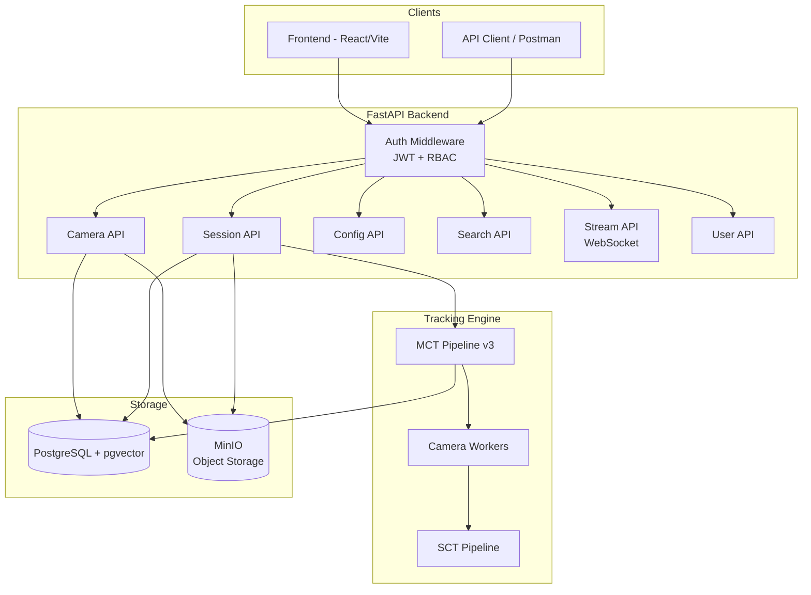

# People Tracking System — Production API Implementation Plan

## Executive Summary
Refactor the existing backend from a demo-level FastAPI app into a **production-grade Multi-Camera Tracking (MCT) API** with:
- **Authentication & RBAC** (Admin / Operator / Viewer)
- **MinIO** object storage for videos, calibration files, and tracking snapshots
- **Camera management** with mandatory calibration
- **MCT session lifecycle** (create → run → stop → review)
- **Real-time streaming** via WebSocket
- **Configuration management** via API (no manual YAML editing)

---

## Architecture Overview



---

## Phase 1: Authentication & RBAC

### Models

| Model | Fields |
|-------|--------|
| `User` | id, username, email, hashed_password, role, is_active, created_at |
| `Role` (enum) | `ADMIN`, `OPERATOR`, `VIEWER` |

### Permissions Matrix

| Action | ADMIN | OPERATOR | VIEWER |
|--------|:-----:|:--------:|:------:|
| Manage users | ✅ | ❌ | ❌ |
| Create/delete cameras | ✅ | ❌ | ❌ |
| Upload calibration | ✅ | ✅ | ❌ |
| Start/stop tracking sessions | ✅ | ✅ | ❌ |
| Edit tracking config | ✅ | ✅ | ❌ |
| View live streams | ✅ | ✅ | ✅ |
| Search persons | ✅ | ✅ | ✅ |
| View tracks/history | ✅ | ✅ | ✅ |

### Endpoints
- `POST /api/v1/auth/register` — Admin only
- `POST /api/v1/auth/login` → JWT token
- `GET /api/v1/auth/me`
- `GET /api/v1/users/` — Admin only
- `PATCH /api/v1/users/{id}` — Admin only
- `DELETE /api/v1/users/{id}` — Admin only

### Dependencies
- New packages: `python-jose[cryptography]`, `passlib[bcrypt]`

---

## Phase 2: MinIO Integration

### Bucket Structure
```
minio/
├── videos/          # Uploaded video files
│   └── {camera_id}/{filename}
├── calibrations/    # Camera calibration JSONs
│   └── {camera_id}/calibration.json
├── snapshots/       # Tracking session output frames
│   └── {session_id}/{frame_id}.jpg
├── recordings/      # Session output videos
│   └── {session_id}/output.mp4
└── thumbnails/      # Camera preview thumbnails
    └── {camera_id}/thumb.jpg
```

### Service Layer
- `MinIOService` singleton with methods: `upload_file()`, `get_presigned_url()`, `download_file()`, `delete_file()`, `list_files()`

### Dependencies
- New package: `minio`

---

## Phase 3: Camera Management (Enhanced)

### Model Changes

```python
class Camera(SQLModel, table=True):
    id: int (PK)
    name: str
    source_type: str  # "rtsp" | "video" | "webcam"
    source_uri: str   # RTSP URL, MinIO path, or device index
    description: str?
    is_active: bool
    location: str?    # Physical location description
    resolution: str?  # e.g. "1920x1080"
    fps: int?
    
    # Calibration (mandatory for MCT)
    has_calibration: bool = False
    calibration_path: str?  # MinIO path
    
    # Metadata
    created_by: int (FK → User)
    created_at: datetime
    updated_at: datetime
```

### Endpoints
- `POST /api/v1/cameras/` — Create camera (Admin)
- `GET /api/v1/cameras/` — List all cameras
- `GET /api/v1/cameras/{id}` — Get camera details
- `PATCH /api/v1/cameras/{id}` — Update camera
- `DELETE /api/v1/cameras/{id}` — Delete camera (Admin)
- `POST /api/v1/cameras/{id}/calibration` — Upload calibration JSON (Admin/Operator)
- `GET /api/v1/cameras/{id}/calibration` — Download calibration
- `DELETE /api/v1/cameras/{id}/calibration` — Remove calibration (Admin)
- `POST /api/v1/cameras/{id}/video` — Upload video file → MinIO (Admin/Operator)
- `GET /api/v1/cameras/{id}/thumbnail` — Get camera thumbnail/preview

---

## Phase 4: Tracking Session Management

### Model

```python
class TrackingSession(SQLModel, table=True):
    id: int (PK)
    name: str
    status: str  # "created" | "running" | "stopping" | "completed" | "failed"
    
    # Config snapshot (frozen at start time)
    sct_config: dict (JSON)
    mct_config: dict (JSON)
    
    # Cameras in this session
    camera_ids: list[int] (JSON)
    
    # Timing
    started_at: datetime?
    stopped_at: datetime?
    
    # Output
    output_video_path: str?   # MinIO path
    output_txt_dir: str?      # MinIO path
    
    # Stats
    total_frames: int = 0
    total_global_ids: int = 0
    avg_fps: float = 0.0
    
    created_by: int (FK → User)
    created_at: datetime
```

### Endpoints
- `POST /api/v1/sessions/` — Create session (select cameras + config)
- `GET /api/v1/sessions/` — List sessions
- `GET /api/v1/sessions/{id}` — Get session details & stats
- `POST /api/v1/sessions/{id}/start` — Start tracking
- `POST /api/v1/sessions/{id}/stop` — Stop tracking
- `DELETE /api/v1/sessions/{id}` — Delete session (Admin)
- `GET /api/v1/sessions/{id}/tracks` — Get tracks for session
- `GET /api/v1/sessions/{id}/output` — Download output video

### Background Processing
- Uses `asyncio` tasks or `threading` for running `MCTPipeline3` in background
- Stores pipeline reference in `SessionManager` singleton
- Reports progress via WebSocket

---

## Phase 5: Configuration Management via API

### Model

```python
class TrackingConfig(SQLModel, table=True):
    id: int (PK)
    name: str
    description: str?
    config_type: str  # "sct" | "mct"
    config_data: dict (JSON)  # The full YAML content as JSON
    is_default: bool = False
    
    created_by: int (FK → User)
    created_at: datetime
    updated_at: datetime
```

### Endpoints
- `POST /api/v1/configs/` — Create config
- `GET /api/v1/configs/` — List configs (filter by type)
- `GET /api/v1/configs/{id}` — Get config
- `PATCH /api/v1/configs/{id}` — Update config
- `DELETE /api/v1/configs/{id}` — Delete config (Admin)
- `POST /api/v1/configs/{id}/duplicate` — Duplicate config
- `GET /api/v1/configs/defaults` — Get default SCT + MCT configs
- `POST /api/v1/configs/validate` — Validate config without saving

---

## Phase 6: Real-time Streaming & Events

### WebSocket Endpoints
- `WS /api/v1/ws/session/{session_id}` — Live tracking frames + events
- `WS /api/v1/ws/camera/{camera_id}` — Single camera preview

### Event Types (over WS)
```json
{"type": "frame", "data": {"frame_id": 1, "base64_jpg": "..."}}
{"type": "track_update", "data": {"global_ids": [...], "tracks": [...]}}
{"type": "stats", "data": {"fps": 25.3, "active_globals": 5}}
{"type": "session_status", "data": {"status": "running"}}
{"type": "alert", "data": {"message": "New person detected", "global_id": 12}}
```

---

## Phase 7: Database & Infrastructure

### Docker Compose (updated)
- PostgreSQL + pgvector
- MinIO
- Backend (FastAPI)
- Frontend (Vite/React)

### Alembic Migrations
- New tables: `user`, `tracking_session`, `tracking_config`
- Modified tables: `camera` (new fields)

---

## File Structure (Final)

```
be/src/
├── main.py                          # FastAPI app + lifespan
├── api/
│   └── v1/
│       ├── api.py                   # Router aggregation
│       ├── deps.py                  # Shared dependencies (auth, db, minio)
│       └── endpoints/
│           ├── auth.py              # Login/register
│           ├── users.py             # User management
│           ├── cameras.py           # Camera CRUD + calibration
│           ├── sessions.py          # Tracking session lifecycle
│           ├── configs.py           # Config management
│           ├── tracks.py            # Track queries
│           ├── search.py            # Person search (existing)
│           ├── frames.py            # Frame extraction (existing)
│           └── ws.py                # WebSocket streaming
├── core/
│   ├── config.py                    # App settings (env vars)
│   ├── security.py                  # JWT + password hashing
│   ├── model_loader.py              # ML model singleton
│   ├── stream_manager.py            # Pipeline lifecycle
│   └── minio_client.py              # MinIO service
├── database/
│   ├── session.py                   # DB engine + session
│   └── init_data.py                 # Seed default admin + configs
├── models/
│   ├── user.py
│   ├── camera.py
│   ├── track.py
│   ├── tracking_session.py
│   ├── tracking_config.py
│   ├── gallery_track.py
│   └── video_segment.py
├── schemas/
│   ├── auth.py
│   ├── user.py
│   ├── camera.py
│   ├── track.py
│   ├── session.py
│   └── config.py
├── services/
│   ├── auth_service.py
│   ├── camera_service.py
│   ├── session_service.py
│   ├── config_service.py
│   └── minio_service.py
├── modules/                         # (existing tracking modules)
├── pipelines/                       # (existing pipelines)
└── utils/                           # (existing utilities)
```

---

## Implementation Order

1. **Phase 1** — Auth & RBAC (foundation for everything else)
2. **Phase 2** — MinIO integration (storage layer)
3. **Phase 3** — Camera management (depends on MinIO)
4. **Phase 4** — Tracking sessions (depends on cameras + config)
5. **Phase 5** — Config management (can be parallel with Phase 4)
6. **Phase 6** — WebSocket streaming (depends on sessions)
7. **Phase 7** — Docker Compose + migrations + seed data

> [!IMPORTANT]
> All existing pipelines (`MCTPipeline3`, `CameraWorker`, `SingleTrackManager`, etc.) remain unchanged. The API wraps them with proper lifecycle management.
