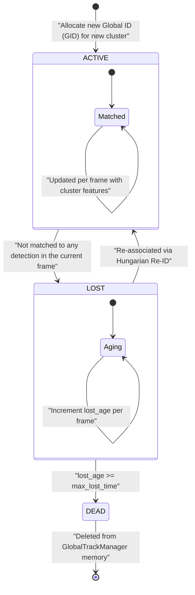

# Multi-Camera Tracking (MCT) Workflow & Architecture

This document provides a comprehensive, production-grade technical overview and detailed architectural breakdown of the **Multi-Camera Tracking (MCT)** system. It covers the end-to-end processing pipeline, cross-camera clustering mathematics, same-camera spatial exclusion constraints, and the conflict-free static global ID (GID) allocation logic.

---

> [!IMPORTANT]
> **Draw.io Design Templates Available:**
> I have designed professional, high-resolution vector diagrams for this workflow. You can open, edit, and export them directly on **[Draw.io / Diagrams.net](https://app.diagrams.net)**:
> 1. MCT Flowchart Design: **[mct.drawio](file:///home/dungnt/workspaces/HUST/People-Tracking-System/mct.drawio)**
> 2. Global Track State Machine: **[mct_state_machine.drawio](file:///home/dungnt/workspaces/HUST/People-Tracking-System/mct_state_machine.drawio)**
>
> **How to Open:** Go to **[draw.io](https://app.diagrams.net)** and drag-and-drop the corresponding `.drawio` file into the browser window. You can edit the layouts and export them as high-quality PNG, SVG, or PDF!

---

## 1. General System Overview (High-Level Pipeline)

The MCT system coordinates multiple parallel Single Camera Tracking (SCT) workers, aggregates their active targets, transforms 2D image coordinates to a unified 3D ground plane, solves a multi-modal cost-matching problem, clusters tracks, and assigns stable, conflict-free global identities.

Below is the **General System Flowchart** representing the data processing pipeline for each synchronized video frame:

```mermaid
graph TD
    %% Theme Styling
    classDef input fill:#1E293B,stroke:#38BDF8,stroke-width:2px,color:#F8FAFC
    classDef process fill:#0F172A,stroke:#F43F5E,stroke-width:2px,color:#F8FAFC
    classDef gallery fill:#0F172A,stroke:#10B981,stroke-width:2px,color:#F8FAFC
    classDef output fill:#1E293B,stroke:#F59E0B,stroke-width:2px,color:#F8FAFC

    A["Start: Synchronized Frame Timestep"] :::input --> B["1. Parallel SCT Processing\n(CameraWorker 1, 2, ..., C)"] :::process
    B --> C["2. Flatten Active SCT Tracks\n(Cam ID, Local PID, Features)"] :::process
    C --> D["3. Homography Projection\n(Feet coordinates projected to Ground Plane)"] :::process
    D --> E["4. Multi-Modal Cost Formulation\n(Ground Euclidean & Re-ID Cosine Distance)"] :::process
    
    %% Gating & Clustering
    E --> F["5. Apply Gates & Exclusion Constraints\n(Same-camera cost set to Infinity)"] :::process
    F --> G["6. Union-Find Clustering\n(Same-camera component root exclusion)"] :::process
    
    %% Global ID Allocation
    G --> H["7. Gather Static GID Locks\n(Extract historical frame & memory locks)"] :::gallery
    H --> I["8. Resolve Cluster GID Representatives\n(Frequency voting + Permissibility check)"] :::gallery
    I --> J["9. Hungarian Re-ID for Unassigned Clusters\n(Cost matrix masking for duplicate protection)"] :::gallery
    J --> K["10. Allocate New Global GIDs\n(Conflict-free incremental sequences)"] :::gallery
    
    %% Sync & Visualization
    K --> L["11. Smooth Global Track Features\n(EMA smoothing & database update)"] :::gallery
    L --> M["12. Generate Multi-Camera MOT15 Logs\n(Write camX_mct.txt files)"] :::output
    M --> N["13. Render Visual Grid Output\n(Draw Grid & Save VideoWriter)"] :::output
    N --> O["End of Frame Timestep"] :::input
```

---

## 2. Global Track State Machine

Each global track (`GlobalTrack`) is persisted in the global track manager's memory database and undergoes a simple yet highly effective three-state lifecycle:



---

## 3. Detailed Component Breakdown

### A. Parallel SCT Processing (`CameraWorker`)
*   **Role:** Each camera runs an independent thread or sequential worker carrying out the full SCT pipeline (Detection $\rightarrow$ SORT $\rightarrow$ FastReID $\rightarrow$ SingleTrackManager).
*   **Output:** Generates local active tracks. Only tracks with confirmed local `person_id` and high-quality visual features are submitted for cross-camera association.

### B. Homography Projection (3D Ground Mapping)
To compare positions across different fields of view, the 2D image coordinates of the targets' feet are projected onto a unified ground plane.
*   **Target point:** Computed as the midpoint of the bounding box bottom line:
    $$x_{\text{foot}} = \frac{x_1 + x_2}{2}, \quad y_{\text{foot}} = y_2$$
*   **Transformation:** Projected using the camera's inverse homography matrix $H^{-1}$:
    $$\begin{bmatrix} X_{\text{world}} \\ Y_{\text{world}} \\ W \end{bmatrix} = H^{-1} \cdot \begin{bmatrix} x_{\text{foot}} \\ y_{\text{foot}} \\ 1 \end{bmatrix}$$
    $$P_{\text{world}} = \begin{bmatrix} X_{\text{world}} / W \\ Y_{\text{world}} / W \end{bmatrix}$$

### C. Multi-Modal Cost Matrix Formulation
A pairwise cost matrix is constructed combining ground distance and visual feature distance.
*   **Normalized Ground Distance:** Bipartite Euclidean distance between world projected points, bounded between $0.0$ and $1.0$ by the homography threshold $\theta_{\text{homo}}$:
    $$d_{\text{homo}}(i, j) = \| P_{\text{world}}^{(i)} - P_{\text{world}}^{(j)} \|_2$$
    $$\bar{d}_{\text{homo}}(i, j) = \min\left(\frac{d_{\text{homo}}(i, j)}{\theta_{\text{homo}}}, 1.0\right)$$
*   **Visual Distance:** Cosine distance between extracted 512-dimensional FastReID features:
    $$d_{\text{vis}}(i, j) = 1 - \frac{\mathbf{f}_i \cdot \mathbf{f}_j}{\|\mathbf{f}_i\|_2 \|\mathbf{f}_j\|_2}$$
*   **Combined Cost Formulation:**
    $$\text{Cost}(i, j) = w_{\text{homo}} \cdot \bar{d}_{\text{homo}}(i, j) + w_{\text{vis}} \cdot d_{\text{vis}}(i, j)$$
*   **Hard Gating & Exclusion Constraints:**
    *   If visual distance is too high ($d_{\text{vis}} > \theta_{\text{vis\_gate}}$), $\text{Cost}(i, j) = \infty$.
    *   If homography distance is too high ($d_{\text{homo}} > \theta_{\text{homo\_gate}}$), $\text{Cost}(i, j) = \infty$.
    *   **Same-Camera Exclusion Principle:** If targets $i$ and $j$ originate from the same camera, $\text{Cost}(i, j) = \infty$. This prevents a single person from being matched to themselves in the same camera view.

### D. Union-Find Clustering with Same-Camera Bipartite Exclusion
*   Valid edges (where $\text{Cost}(i, j) < \theta_{\text{combined}}$) are processed in ascending order of cost.
*   The Union-Find algorithm merges components, but strictly enforces the **Same-Camera Exclusion Constraint**:
    $$\text{If } \text{Cameras}(r_a) \cap \text{Cameras}(r_b) \neq \emptyset \implies \text{Skip Union}$$
    This mathematically guarantees that no cluster will ever contain more than one track from the same camera.

### E. Conflict-Free Static GID Locking & Re-ID Allocation
To resolve global ID jumping while ensuring that no duplicate GIDs are assigned to the same camera in a frame, the `GlobalTrackManager` executes the following algorithm:

1.  **Static Lock Accumulation:**
    Retrieves the current frame's static GIDs and previous frame's memory mapping. Maps which `(cid, pid)` track has locked which `gid`.
2.  **Permissibility Verification:**
    A candidate GID $g$ is permissible for a cluster $k$ if and only if for every track $i \in k$:
    $$\text{If } g \text{ is locked on camera } \text{cid}_i \implies gid\_locked\_by[g] == (\text{cid}_i, \text{pid}_i)$$
    If another track on the same camera has locked $g$, then $g$ is non-permissible for cluster $k$.
3.  **Representative GID Resolution:**
    Gathers all locked GIDs within cluster $k$. Sorts candidates by frequency descending. Assigns the first permissible candidate. If none are permissible, cluster GID remains `None`.
4.  **Hungarian Re-ID Cost Masking:**
    Unassigned clusters are matched against unused historical GIDs using Hungarian bipartite matching. To prevent duplicate conflicts, the cost is masked:
    $$\text{If } \text{GID } g_j \text{ is not permissible for cluster } k_i \implies \text{Cost}(i, j) = 10^6$$
    This mathematically prevents Hungarian assignment from violating the same-camera unique GID constraint.
5.  **New GID Allocation:**
    Clusters still without a GID are allocated an incremental, unique new GID sequence.

---

## 4. Key Configuration Parameters (`mct_config.yaml`)

| Configuration Key | Typical Value | Description |
| :--- | :--- | :--- |
| `weights.homography` | `0.5` | Weight of ground plane spatial distance in combined cost. |
| `weights.visual` | `0.5` | Weight of visual Re-ID feature similarity in combined cost. |
| `thresholds.homography` | `2.0` | Spatial distance threshold (in meters) to normalize ground distance. |
| `thresholds.visual_gate` | `0.55` | Hard limit of visual Cosine distance. Any pair exceeding this is gated. |
| `thresholds.combined` | `0.6` | Maximum combined cost allowed for two targets to be clustered. |
| `thresholds.reid` | `0.5` | Distance threshold for Hungarian global Re-ID matching. |
| `global_track.max_lost_time` | `50` | Maximum frames a global track remains `LOST` before being declared `DEAD`. |
| `global_track.feat_smooth` | `0.9` | EMA smoothing factor for global tracks profile feature updating. |
