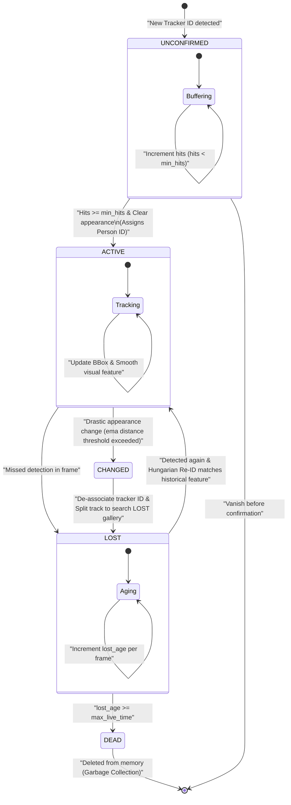

# Single Camera Tracking (SCT) Workflow & Architecture

This document provides a comprehensive technical overview and detailed architectural breakdown of the **Single Camera Tracking (SCT)** system. It describes the sequential data flow per frame, the track lifecycle state machine, and the mathematical and logical mechanisms used to handle noise filtering, visual appearance smoothing, track splitting, and local identity recovery (Re-ID).

---

> [!IMPORTANT]
> **Draw.io Design Templates Available:**
> I have designed professional, production-grade vector diagrams for this workflow. You can open, edit, and export them directly on **[Draw.io / Diagrams.net](https://app.diagrams.net)**:
> 1. SCT Luơng/Flowchart Design: **[sct.drawio](file:///home/dungnt/workspaces/HUST/People-Tracking-System/sct.drawio)**
> 2. Track Lifecycle State Machine: **[sct_state_machine.drawio](file:///home/dungnt/workspaces/HUST/People-Tracking-System/sct_state_machine.drawio)**
>
> **How to Open:** Go to **[draw.io](https://app.diagrams.net)** and drag-and-drop the corresponding `.drawio` file into the browser window. You can edit the layouts and export them as high-resolution PNG, SVG, or PDF!

---

## 1. General System Overview (High-Level Pipeline)

The SCT system processes incoming video streams frame-by-frame. The core objective is to detect individuals, associate them temporally across frames, smooth their visual appearances, and robustly recover their identities after short-term occlusion.

Below is the **General System Flowchart** representing the data processing pipeline for each video frame:

```mermaid
graph TD
    %% Theme Styling
    classDef input fill:#1E293B,stroke:#38BDF8,stroke-width:2px,color:#F8FAFC
    classDef process fill:#0F172A,stroke:#F43F5E,stroke-width:2px,color:#F8FAFC
    classDef gallery fill:#0F172A,stroke:#10B981,stroke-width:2px,color:#F8FAFC
    classDef output fill:#1E293B,stroke:#F59E0B,stroke-width:2px,color:#F8FAFC

    A["Start: New Video Frame"] :::input --> B["1. Video Recording (Optional)"] :::process
    B --> C["2. Human Detection (YOLOv11 Detector)"] :::process
    C -->|BBoxes| D["3. 2D Frame Association (SORT Tracker)"] :::process
    D -->|Raw Tracks [Tracker ID + BBox]| E["4. Single Track Manager (Re-ID Engine)"] :::gallery
    
    %% Track Manager Sub-steps
    E --> E1["Feature Extraction (FastReID Embedder)"] :::gallery
    E1 --> E2{"Tracker ID already in Gallery?"} :::gallery
    
    E2 -->|Yes| E3["Update Confirmed Track & Smooth Features"] :::gallery
    E2 -->|No| E4["Buffer Unconfirmed Track (L2 Norm)"] :::gallery
    
    %% Confirmed Track Path
    E3 --> E5{"Appearance Anomalies Detected?"} :::gallery
    E5 -->|No| E6["Maintain ACTIVE State & Keep Person ID"] :::gallery
    E5 -->|Yes| E7["Mark Old Person ID LOST & Split Track"] :::gallery
    
    %% Unconfirmed Track Path
    E4 --> E8{"Hits >= min_hits & Valid Full Body?"} :::gallery
    E8 -->|No| E9["Keep Unconfirmed State & Wait"] :::gallery
    E8 -->|Yes| E10["Confirm Track & Submit to Re-ID"] :::gallery
    
    %% Re-ID Engine Match
    E7 --> E11["Hungarian Re-ID Match against LOST Gallery"] :::gallery
    E10 --> E11
    
    E11 --> E12{"Match Found (Distance < Threshold)?"} :::gallery
    E12 -->|Yes| E13["Assign Historical Person ID & Promote to ACTIVE"] :::gallery
    E12 -->|No| E14["Allocate New Person ID & Promote to ACTIVE"] :::gallery
    
    %% Synchronization & Cleanup
    E6 --> F["5. Purge Stale LOST & DEAD Tracks (Cleanup)"] :::gallery
    E13 --> F
    E14 --> F
    E9 --> F
    
    F --> G["6. Persist Tracks (SQLModel Database)"] :::output
    G --> H["7. Visualization / MJPEG Streaming"] :::output
    H --> I["End of Frame"] :::input
```

---

## 2. Track Lifecycle State Machine

To combat transient occlusions, false positive detections, and appearance drift, `InMemGallery` runs a strict state machine with 5 key states. This keeps tracking highly stable and prevents GID jumps:



---

## 3. Detailed Component Breakdown

### A. Frame Acquisition & Recording
*   **Implementation:** Utilizes `WebcamVideoStream` (running in a separate thread to avoid blocking the main processing thread) to read incoming frames.
*   **Recording:** Optionally writes incoming raw frames using `VideoRecorder` to store historical footage.

### B. Object Detection (YOLOv11 Detector)
*   **Model:** YOLOv11 optimized via ONNX Runtime or TensorRT.
*   **Role:** Detects all bounding boxes of people in the raw image.
*   **Output:** List of `[x1, y1, x2, y2]` bounding boxes with confidence scores.

### C. 2D Temporal Association (SORT Tracker)
*   **Methodology:** Combines a **Kalman Filter** (which models and predicts the motion velocity and position of each target) and the **Hungarian Algorithm** (which solves the bipartite matching between predicted coordinates and newly detected bounding boxes using intersection-over-union - IoU distance).
*   **Output:** Generates a consistent local `tracker_id` for bounding boxes as long as the motion remains continuous.

### D. Feature Extraction (FastReID Embedder)
*   **Model:** FastReID OSNet (specifically `weights/fastreid_osnet-ain_x1.0-ibn_512_256x192_ccdmmps.pth`).
*   **Role:** Extracts a highly representative 512-dimensional visual feature vector from cropped person bounding boxes.
*   **Normalization:** Features are normalized using the L2 Norm:
    $$\mathbf{f} = \frac{\mathbf{f}_{\text{raw}}}{\|\mathbf{f}_{\text{raw}}\|_2 + \epsilon}$$
    This normalisation converts feature comparison into simple dot products (Cosine similarity).

### E. Track Lifecycle & Re-ID Engine (SingleTrackManager & Gallery)
The `SingleTrackManager` coordinates the core business logic of tracking:

1.  **Noise Mitigation (Unconfirmed Buffering):**
    When a new `tracker_id` appears, it is stored in `self.gallery.unconfirmed`. It must accumulate at least `min_hits` detections and have at least one high-quality, clear visual embedding (checked by background pose/bounding box filters) to be promoted. This eliminates false positive detector noise.
2.  **Visual Feature Smoothing:**
    Once confirmed, its embedding is updated using an **Exponential Moving Average (EMA)** to model appearance evolution smoothly:
    $$\mathbf{f}_{\text{smooth}}^{(t)} = (1 - \alpha) \cdot \mathbf{f}_{\text{smooth}}^{(t-1)} + \alpha \cdot \mathbf{f}_{\text{new}}$$
    Where $\alpha$ represents the `smooth_factor` (default: `0.1`).
3.  **Appearance Drift & Occlusion Splitting:**
    If a confirmed track experiences an abrupt visual feature change (distance to historical profile exceeds `appearance_threshold`), the system assumes an occlusion or tracking mismatch has occurred. It:
    *   Marks the old `person_id` as `LOST`.
    *   De-associates the current `tracker_id` from that `person_id`.
    *   Splits the track, creating a new query track to seek re-association.
4.  **Hungarian Re-ID Matching:**
    For newly-confirmed tracks or split tracks requiring identification, the Re-ID engine:
    *   Gathers all tracks currently in the `LOST` state inside `InMemGallery`.
    *   Computes a pairwise Cosine distance matrix between the query tracks and lost gallery profiles.
    *   Applies the **Hungarian Algorithm** to optimize global bipartite matchings.
    *   If a match's distance is below `appearance_threshold`, the track is reconnected to its historical `person_id` and promoted back to `ACTIVE`.
    *   Otherwise, a brand new `person_id` is generated and assigned.

---

## 4. Database Schema & Persistence

Active tracking records are synchronized to a persistent SQL database (SQLite or PostgreSQL) in real-time at the end of each frame processing loop using **SQLModel** (built on top of SQLAlchemy):

| Database Attribute | Data Type | Description |
| :--- | :--- | :--- |
| `id` | `Integer (PK)` | Unique record ID. |
| `camera_id` | `Integer` | Identifier of the camera source. |
| `person_id` | `Integer` | Re-identified Global Person ID. |
| `frame_id` | `Integer` | Video Frame sequence number. |
| `bbox` | `JSON / Array` | Bounding Box array `[x1, y1, x2, y2]`. |
| `score` | `Float` | Confidence score of the detection. |
| `timestamp` | `DateTime` | Real-world date-time of the event. |
| `feature` | `Vector (512)` | Normalised FastReID feature vector (persisted for multi-camera cross-matching). |

---

## 5. Memory Management & Garbage Collection

To guarantee constant memory utilization ($O(1)$ RAM overhead) for indefinitely long stream executions, the gallery performs real-time cleanup:
*   Unconfirmed tracks that disappear for even one frame are instantly purged.
*   If an active track is missed in the frame, it is shifted to `LOST` state.
*   Its `lost_age` is incremented frame-by-frame. Once `lost_age >= max_live_time`, the state is updated to `DEAD` and all associated feature history is garbage collected from memory.
