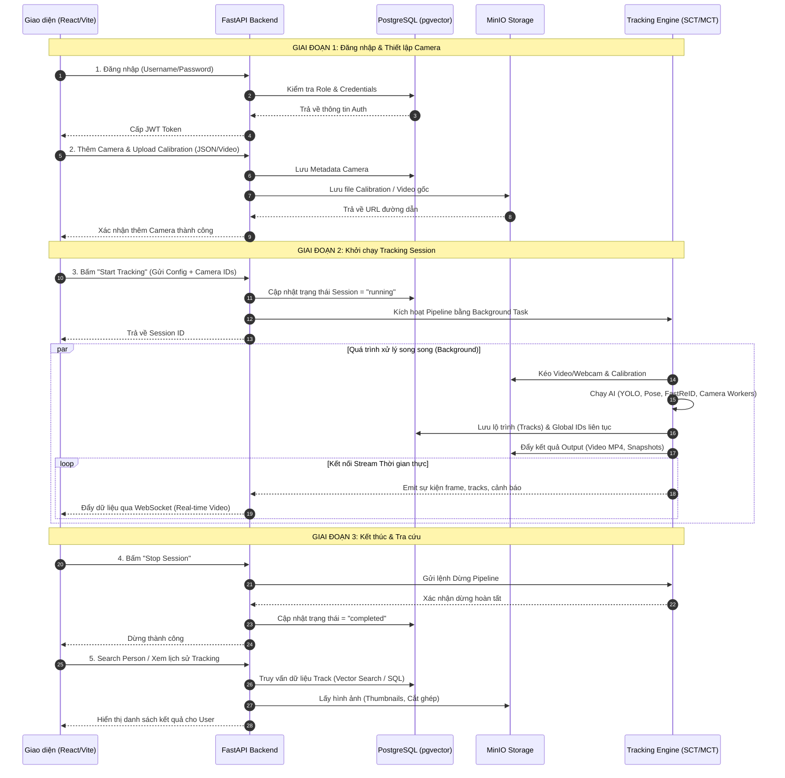

# People Tracking System — Workflow & Architecture Diagrams

## 1. Sequence Diagram: Tracking Session Workflow

Biểu đồ này thể hiện trình tự thời gian khi UI (Frontend) gọi Backend, dữ liệu được truyền đi lưu trữ và Engine AI xử lý.



## 2. High-Level Architecture Diagram

Biểu đồ này mô tả lại mức cao (high-level) cách các component nối với nhau (Ai gọi ai, qua giao thức nào).

```mermaid
graph TD
    %% Định nghĩa các node
    User((Người dùng\nAdmin/Operator))
    FE["Frontend (React / Vite)"]
    
    subgraph API_Layer ["API Layer (FastAPI Backend)"]
        AUTH("Auth & RBAC")
        CAM_API("Camera API")
        SESS_API("Session API")
        WS_API("WebSocket Stream")
    end

    subgraph Core_Engine ["Core Tracking Engine"]
        WORKERS["Camera Workers (SCT)"]
        MCT["MCT Pipeline v3"]
    end

    subgraph Storage ["Dữ liệu (Storage)"]
        DB[("PostgreSQL\n(User, Camera, Config,\nTracks, Session)")]
        MINIO[("MinIO Object Storage\n(Videos, Cals, Outputs)")]
    end

    %% Các luồng dữ liệu
    User -->|Tương tác trên Web| FE
    FE -->|HTTP/REST (Kèm JWT)| AUTH
    FE -.->|WebSocket (Real-time)| WS_API
    
    AUTH --> CAM_API
    AUTH --> SESS_API
    
    %% API tương tác Storage
    CAM_API -->|Đọc/Ghi Metadata| DB
    CAM_API -->|Upload Files| MINIO
    SESS_API -->|Truy vấn cấu hình/Track| DB
    
    %% Gọi Engine
    SESS_API -->|Trigger Start/Stop| MCT
    MCT -->|Phân việc| WORKERS
    
    %% Engine tương tác Storage
    WORKERS -->|Đọc Video/Calib| MINIO
    WORKERS -->|Lưu Track Local| DB
    MCT -->|Lưu Global ID & Metrics| DB
    MCT -->|Lưu Video Output| MINIO
    
    %% Stream feedback
    MCT -.->|Bắn sự kiện/Frames\nqua Queue/Memory| WS_API

    %% Styling 
    classDef frontend fill:#3178C6,stroke:#fff,stroke-width:2px,color:#fff;
    classDef api fill:#009688,stroke:#fff,stroke-width:2px,color:#fff;
    classDef engine fill:#FF9800,stroke:#fff,stroke-width:2px,color:#fff;
    classDef storage fill:#607D8B,stroke:#fff,stroke-width:2px,color:#fff;

    class FE frontend
    class AUTH,CAM_API,SESS_API,WS_API api
    class WORKERS,MCT engine
    class DB,MINIO storage
```
